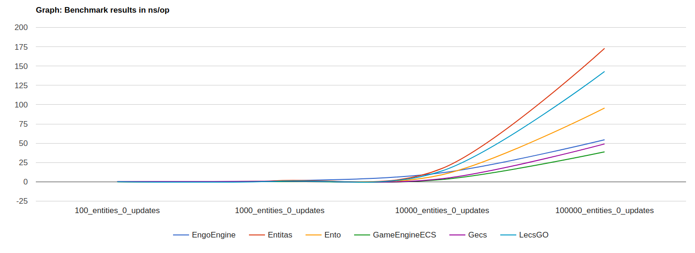
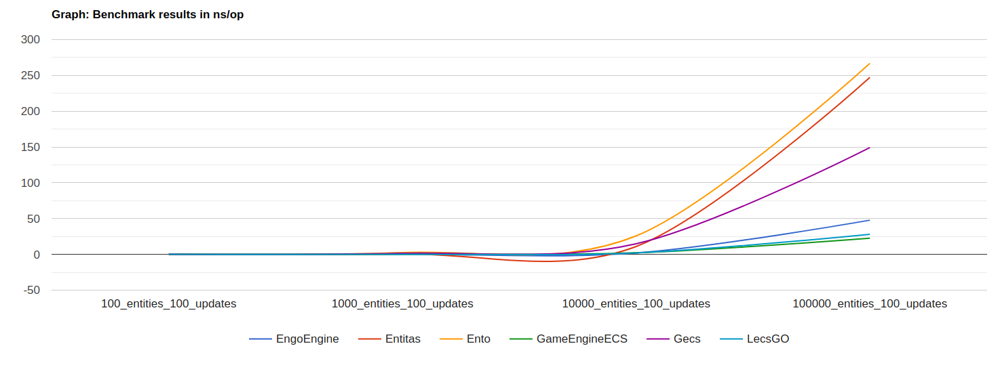
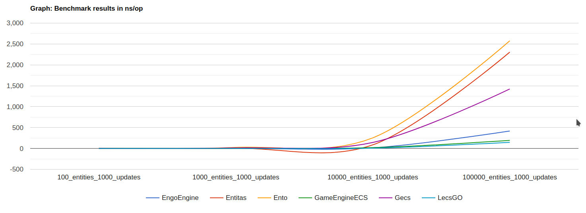
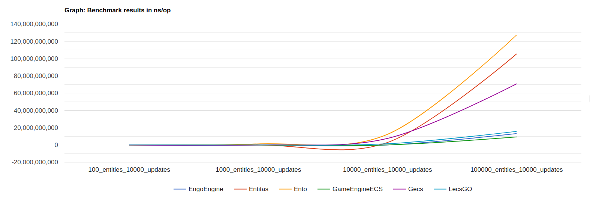

# ECS

## _Fast Entity Component System in Golang_

[](https://github.com/mlange-42/arche/actions/workflows/tests.yml)
[](https://github.com/mlange-42/arche/actions/workflows/coverage.yml)
[](https://pkg.go.dev/github.com/marioolofo/go-gameengine-ecs)
[](https://github.com/marioolofo/go-gameengine-ecs)
[](https://github.com/marioolofo/go-gameengine-ecs/blob/main/LICENSE)

This module is the ECS part of the game engine i'm writing in Go.

Features:

- 256 components limit per world, but an unconstrained alternative coming soon
- modular, you can use only pieces of the code, from entity id generation to archetype graph management
- archetypes for grouping entities with same components for fast linear access
- as fast as packages with automatic code generation, but no setup and regeneration required for every change
- iterator instead of systems for linear memory access of components for a given query
- the code is commented and the documentation can be generated with godoc
- 100% test coverage

### Installation

```sh
go get github.com/marioolofo/go-gameengine-ecs
```

> This project was made with Go 1.18 and it's needed for some bits of generic code

## Example

See the [examples](./examples) folder.

From [simple.go](./examples/simple/simple.go):

```go
package main

import ecs "github.com/marioolofo/go-gameengine-ecs"

// definitions for component ids
const (
	InputComponentID ecs.ComponentID = iota
	PositionComponentID
	SizeComponentID
	ControllableComponentID
	CameraComponentID
)

type Input struct{ xAxis, yAxis, buttons int }
type Position struct{ x, y float32 }
type Size struct{ width, height float32 }
type Controllable struct{}
type Camera struct{ follows ecs.EntityID }

func main() {
	// NewWorld creates the world. See lowlevel.go example for a behind the scenes version
	world := ecs.NewWorld(10)

	// First we need to register the components to be able to use them:
	// NewComponentRegistry[T] simplify the creation of the component's definition struct
	world.Register(ecs.NewComponentRegistry[Position](PositionComponentID))
	world.Register(ecs.NewComponentRegistry[Size](SizeComponentID))
	world.Register(ecs.NewComponentRegistry[Camera](CameraComponentID))

	// Tag components without data are valid components:
	world.Register(ecs.NewComponentRegistry[Controllable](ControllableComponentID))

	// We can have singleton components. It'll be created when the first entity needs it and
	// every call to this component will always return the same pointer
	world.Register(ecs.NewSingletonComponentRegistry[Input](InputComponentID))

	// NewEntity adds the entity with declared components to the world and return the EntityID.
	gameWorldID := world.NewEntity(InputComponentID)
	playerID := world.NewEntity(ControllableComponentID, PositionComponentID, SizeComponentID)
	cameraID := world.NewEntity(CameraComponentID, PositionComponentID, SizeComponentID)

	// world.Component return the pointer to the entity's component
	cam := (*Camera)(world.Component(cameraID, CameraComponentID))
	cam.follows = playerID

	// Get the input singleton to update every controllable entity
	actualInput := (*Input)(world.Component(gameWorldID, InputComponentID))

	// World.Query creates a iterator for entities that have the requested components
	//
	// This solution is better than using Systems to update the entities because it's up to
	// the programmer to decide at what rates every group of entities updates.
	// Because of Archetypes, the layout of components in memory are sequentially, making
	// the iterations for the most part access the components linearly in memory
	query := world.Query(ecs.MakeComponentMask(ControllableComponentID, PositionComponentID))
	// QueryCursor.Next will return false when we iterate over all found entities
	for query.Next() {
		// QueryCursor.Component will return the component for this entity
		pos := (*Position)(query.Component(PositionComponentID))
		pos.x += float32(actualInput.xAxis)
		pos.y += float32(actualInput.yAxis)
	}

	// Now, update the cameras with the followed entity's position
	query = world.Query(ecs.MakeComponentMask(CameraComponentID))
	for query.Next() {
		cam = (*Camera)(query.Component(CameraComponentID))
		camPos := (*Position)(query.Component(PositionComponentID))

		// only follow if the entity is still alive:
		if world.IsAlive(cam.follows) {
			followPos := (*Position)(world.Component(cam.follows, PositionComponentID))

			camPos.x = followPos.x
			camPos.y = followPos.y
		} else {
			camPos.x = float32(0.0)
			camPos.y = float32(0.0)
		}
	}
}
```

### Benchmarks

## 2023/02/23 - These benchmarks are from the old version of this package and I'll update them ASAP

The benchmark folder contains the implementations of a simple test case for
performance comparison for this package as GameEngineECS, [Entitas](https://github.com/Falldot/Entitas-Go), [Ento](https://github.com/wfranczyk/ento), [Gecs](https://github.com/tutumagi/gecs), [LecsGO](https://github.com/Leopotam/go-ecs), [EngoEngine](github.com/EngoEngine/ecs) and [Arche](https://github.com/mlange-42/arche) and below are the results running on my machine.

_Notice that **EngoEngine** lets to you the responsability for keeping track of entities in the systems,
so the results may be diferent for other scenarios or usecases (to be implemented)._

**Just creation and 4 components addition to the world:**

```sh
goos: linux
goarch: amd64
pkg: github.com/marioolofo/go-gameengine-ecs/benchmark
cpu: Intel(R) Core(TM) i5-8300H CPU @ 2.30GHz
BenchmarkEngoEngine_100_entities_0_updates-8         	1000000000	         0.0000218 ns/op
BenchmarkEngoEngine_1000_entities_0_updates-8        	1000000000	         0.0002023 ns/op
BenchmarkEngoEngine_10000_entities_0_updates-8       	1000000000	         0.001765 ns/op
BenchmarkEngoEngine_100000_entities_0_updates-8      	1000000000	         0.02435 ns/op
BenchmarkEntitas_100_entities_0_updates-8            	1000000000	         0.0001840 ns/op
BenchmarkEntitas_1000_entities_0_updates-8           	1000000000	         0.0007055 ns/op
BenchmarkEntitas_10000_entities_0_updates-8          	1000000000	         0.008448 ns/op
BenchmarkEntitas_100000_entities_0_updates-8         	1000000000	         0.09315 ns/op
BenchmarkEnto_100_entities_0_updates-8               	1000000000	         0.0000642 ns/op
BenchmarkEnto_1000_entities_0_updates-8              	1000000000	         0.0004820 ns/op
BenchmarkEnto_10000_entities_0_updates-8             	1000000000	         0.003454 ns/op
BenchmarkEnto_100000_entities_0_updates-8            	1000000000	         0.04797 ns/op
BenchmarkGameEngineECS_100_entities_0_updates-8      	1000000000	         0.0000849 ns/op
BenchmarkGameEngineECS_1000_entities_0_updates-8     	1000000000	         0.0001953 ns/op
BenchmarkGameEngineECS_10000_entities_0_updates-8    	1000000000	         0.001686 ns/op
BenchmarkGameEngineECS_100000_entities_0_updates-8   	1000000000	         0.02034 ns/op
BenchmarkGecs_100_entities_0_updates-8               	1000000000	         0.0007248 ns/op
BenchmarkGecs_1000_entities_0_updates-8              	1000000000	         0.0003266 ns/op
BenchmarkGecs_10000_entities_0_updates-8             	1000000000	         0.002361 ns/op
BenchmarkGecs_100000_entities_0_updates-8            	1000000000	         0.02372 ns/op
BenchmarkLecsGO_100_entities_0_updates-8             	1000000000	         0.0000705 ns/op
BenchmarkLecsGO_1000_entities_0_updates-8            	1000000000	         0.0004838 ns/op
BenchmarkLecsGO_10000_entities_0_updates-8           	1000000000	         0.006037 ns/op
BenchmarkLecsGO_100000_entities_0_updates-8          	1000000000	         0.07106 ns/op
PASS
ok  	github.com/marioolofo/go-gameengine-ecs/benchmark	2.654s
```



#### Iteration time for 100~10,000 entities:

**100 iterations:**

```sh
goos: linux
goarch: amd64
pkg: github.com/marioolofo/go-gameengine-ecs/benchmark
cpu: Intel(R) Core(TM) i5-8300H CPU @ 2.30GHz
BenchmarkEngoEngine_100_entities_100_updates-8         	1000000000	         0.0000845 ns/op
BenchmarkEngoEngine_1000_entities_100_updates-8        	1000000000	         0.0009191 ns/op
BenchmarkEngoEngine_10000_entities_100_updates-8       	1000000000	         0.009456 ns/op
BenchmarkEngoEngine_100000_entities_100_updates-8      	1000000000	         0.1757 ns/op
BenchmarkEntitas_100_entities_100_updates-8            	1000000000	         0.0002135 ns/op
BenchmarkEntitas_1000_entities_100_updates-8           	1000000000	         0.002982 ns/op
BenchmarkEntitas_10000_entities_100_updates-8          	1000000000	         0.03583 ns/op
BenchmarkEntitas_100000_entities_100_updates-8         	       1	1126714665 ns/op
BenchmarkEnto_100_entities_100_updates-8               	1000000000	         0.001355 ns/op
BenchmarkEnto_1000_entities_100_updates-8              	1000000000	         0.01245 ns/op
BenchmarkEnto_10000_entities_100_updates-8             	1000000000	         0.1271 ns/op
BenchmarkEnto_100000_entities_100_updates-8            	       1	1325536011 ns/op
BenchmarkGameEngineECS_100_entities_100_updates-8      	1000000000	         0.0002114 ns/op
BenchmarkGameEngineECS_1000_entities_100_updates-8     	1000000000	         0.001107 ns/op
BenchmarkGameEngineECS_10000_entities_100_updates-8    	1000000000	         0.01083 ns/op
BenchmarkGameEngineECS_100000_entities_100_updates-8   	1000000000	         0.1112 ns/op
BenchmarkGecs_100_entities_100_updates-8               	1000000000	         0.0007154 ns/op
BenchmarkGecs_1000_entities_100_updates-8              	1000000000	         0.007240 ns/op
BenchmarkGecs_10000_entities_100_updates-8             	1000000000	         0.07199 ns/op
BenchmarkGecs_100000_entities_100_updates-8            	1000000000	         0.7301 ns/op
BenchmarkLecsGO_100_entities_100_updates-8             	1000000000	         0.0000740 ns/op
BenchmarkLecsGO_1000_entities_100_updates-8            	1000000000	         0.0007187 ns/op
BenchmarkLecsGO_10000_entities_100_updates-8           	1000000000	         0.009319 ns/op
BenchmarkLecsGO_100000_entities_100_updates-8          	1000000000	         0.1292 ns/op
PASS
ok  	github.com/marioolofo/go-gameengine-ecs/benchmark	42.865s
```



**1,000 iterations:**

```sh
goos: linux
goarch: amd64
pkg: github.com/marioolofo/go-gameengine-ecs/benchmark
cpu: Intel(R) Core(TM) i5-8300H CPU @ 2.30GHz
BenchmarkEngoEngine_100_entities_1000_updates-8         	1000000000	         0.0006254 ns/op
BenchmarkEngoEngine_1000_entities_1000_updates-8        	1000000000	         0.007021 ns/op
BenchmarkEngoEngine_10000_entities_1000_updates-8       	1000000000	         0.07600 ns/op
BenchmarkEngoEngine_100000_entities_1000_updates-8      	       1	1349145574 ns/op
BenchmarkEntitas_100_entities_1000_updates-8            	1000000000	         0.001256 ns/op
BenchmarkEntitas_1000_entities_1000_updates-8           	1000000000	         0.02259 ns/op
BenchmarkEntitas_10000_entities_1000_updates-8          	1000000000	         0.2912 ns/op
BenchmarkEntitas_100000_entities_1000_updates-8         	       1	10328067642 ns/op
BenchmarkEnto_100_entities_1000_updates-8               	1000000000	         0.01217 ns/op
BenchmarkEnto_1000_entities_1000_updates-8              	1000000000	         0.1232 ns/op
BenchmarkEnto_10000_entities_1000_updates-8             	       1	1236405407 ns/op
BenchmarkEnto_100000_entities_1000_updates-8            	       1	12721365771 ns/op
BenchmarkGameEngineECS_100_entities_1000_updates-8      	1000000000	         0.001022 ns/op
BenchmarkGameEngineECS_1000_entities_1000_updates-8     	1000000000	         0.009422 ns/op
BenchmarkGameEngineECS_10000_entities_1000_updates-8    	1000000000	         0.09406 ns/op
BenchmarkGameEngineECS_100000_entities_1000_updates-8   	1000000000	         0.9446 ns/op
BenchmarkGecs_100_entities_1000_updates-8               	1000000000	         0.007726 ns/op
BenchmarkGecs_1000_entities_1000_updates-8              	1000000000	         0.06897 ns/op
BenchmarkGecs_10000_entities_1000_updates-8             	1000000000	         0.7034 ns/op
BenchmarkGecs_100000_entities_1000_updates-8            	       1	7117594882 ns/op
BenchmarkLecsGO_100_entities_1000_updates-8             	1000000000	         0.0005196 ns/op
BenchmarkLecsGO_1000_entities_1000_updates-8            	1000000000	         0.003643 ns/op
BenchmarkLecsGO_10000_entities_1000_updates-8           	1000000000	         0.03769 ns/op
BenchmarkLecsGO_100000_entities_1000_updates-8          	1000000000	         0.6236 ns/op
PASS
ok  	github.com/marioolofo/go-gameengine-ecs/benchmark	177.623s
```



**10,000 iterations:**

```sh
goos: linux
goarch: amd64
pkg: github.com/marioolofo/go-gameengine-ecs/benchmark
cpu: Intel(R) Core(TM) i5-8300H CPU @ 2.30GHz
BenchmarkEngoEngine_100_entities_10000_updates-8         	1000000000	         0.005653 ns/op
BenchmarkEngoEngine_1000_entities_10000_updates-8        	1000000000	         0.06794 ns/op
BenchmarkEngoEngine_10000_entities_10000_updates-8       	1000000000	         0.7393 ns/op
BenchmarkEngoEngine_100000_entities_10000_updates-8      	       1	13142254965 ns/op
BenchmarkEntitas_100_entities_10000_updates-8            	1000000000	         0.01188 ns/op
BenchmarkEntitas_1000_entities_10000_updates-8           	1000000000	         0.2206 ns/op
BenchmarkEntitas_10000_entities_10000_updates-8          	       1	2856435193 ns/op
BenchmarkEntitas_100000_entities_10000_updates-8         	       1	105500478112 ns/op
BenchmarkEnto_100_entities_10000_updates-8               	1000000000	         0.1234 ns/op
BenchmarkEnto_1000_entities_10000_updates-8              	       1	1215646893 ns/op
BenchmarkEnto_10000_entities_10000_updates-8             	       1	12336209652 ns/op
BenchmarkEnto_100000_entities_10000_updates-8            	       1	127410246972 ns/op
BenchmarkGameEngineECS_100_entities_10000_updates-8      	1000000000	         0.009515 ns/op
BenchmarkGameEngineECS_1000_entities_10000_updates-8     	1000000000	         0.09226 ns/op
BenchmarkGameEngineECS_10000_entities_10000_updates-8    	1000000000	         0.9229 ns/op
BenchmarkGameEngineECS_100000_entities_10000_updates-8   	       1	9280284220 ns/op
BenchmarkGecs_100_entities_10000_updates-8               	1000000000	         0.07238 ns/op
BenchmarkGecs_1000_entities_10000_updates-8              	      34	  31453421 ns/op
BenchmarkGecs_10000_entities_10000_updates-8             	       1	7598556343 ns/op
BenchmarkGecs_100000_entities_10000_updates-8            	       1	70832011441 ns/op
BenchmarkLecsGO_100_entities_10000_updates-8             	1000000000	         0.01323 ns/op
BenchmarkLecsGO_1000_entities_10000_updates-8            	1000000000	         0.1331 ns/op
BenchmarkLecsGO_10000_entities_10000_updates-8           	       1	1361573818 ns/op
BenchmarkLecsGO_100000_entities_10000_updates-8          	       1	15729605049 ns/op
PASS
ok  	github.com/marioolofo/go-gameengine-ecs/benchmark	492.671s
```



## License

This project is distributed under the MIT licence.

```
MIT License

Copyright (c) 2022 Mario Olofo <mario.olofo@gmail.com>

Permission is hereby granted, free of charge, to any person obtaining a copy
of this software and associated documentation files (the "Software"), to deal
in the Software without restriction, including without limitation the rights
to use, copy, modify, merge, publish, distribute, sublicense, and/or sell
copies of the Software, and to permit persons to whom the Software is
furnished to do so, subject to the following conditions:

The above copyright notice and this permission notice shall be included in all
copies or substantial portions of the Software.

THE SOFTWARE IS PROVIDED "AS IS", WITHOUT WARRANTY OF ANY KIND, EXPRESS OR
IMPLIED, INCLUDING BUT NOT LIMITED TO THE WARRANTIES OF MERCHANTABILITY,
FITNESS FOR A PARTICULAR PURPOSE AND NONINFRINGEMENT. IN NO EVENT SHALL THE
AUTHORS OR COPYRIGHT HOLDERS BE LIABLE FOR ANY CLAIM, DAMAGES OR OTHER
LIABILITY, WHETHER IN AN ACTION OF CONTRACT, TORT OR OTHERWISE, ARISING FROM,
OUT OF OR IN CONNECTION WITH THE SOFTWARE OR THE USE OR OTHER DEALINGS IN THE
SOFTWARE.

```
